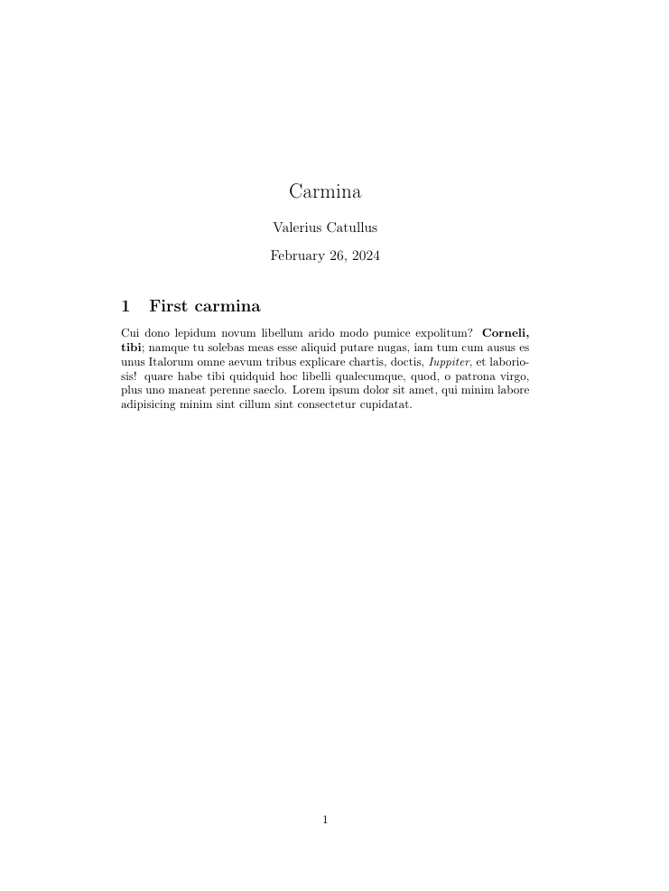

> *A specter is haunting Internet—the specter of plain text files. All the tech
giants have entered into a holy alliance to exorcise this specter; Microsoft
and its Word, Google Docs and One Note, Bean and Apple spies products.* (Semicit.)

They are all around us: on the bus and in the crowded train carriage;
they live in the university classes, in the high school homework tasks, in every
company's workflow.

They are the `.docx` files.

## Nuking ants for a living

I vividly remember my high school math lessons, probably because of the damages
that all that gibberish did to my self confidence (don't worry, I understood the
usefulness of all that in the end :-)).

When finally we were introduced to integrals, the math professor
warned us that

> *...using integrals sometimes is just as killing ants with a bazooka...*

a saying that doesn't sound so nice but seems to have been stuck in my head
since then.
The gist of the saying is obvious: do not abuse this tool, particularly because
it's overkill for some specific tasks.

At the end of the day this is no surprising stuff. Life and evolution are the
result of optimization and adaptation, none of which encourages wastage of resources
for an unworthy activity or the usage of disproportionate means to achieve a
simple goal.
To understand what I mean I really suggest you to take a look at
[this short video](https://www.youtube.com/watch?v=SLFgFCmCg6Q),
you'll be in awe for the brilliant strategy used by eagles to hunt for goats
and other big mammals.

In the following article I'll try to argue why, in my opinion, writing, editing
and sharing textual content in the form of plain text format is easier, less expensive
and more rewarding. On the contrary, using WYSIWYG editors (What-You-See-Is-What-You-Get)
and their related formats like docx is more complex, generates less-portable files
and overall complicates the interaction with your digitally-written content.

## Computers, software, practicality

Different people want different things from their computers: some use them for
work related tasks and thus need productivity and practicality, some others use
them to surf the web and do basic stuff. A restricted group of people even use
them to write software.
All these use cases have some aspects in common, that I'll formalize as follows:

1. **Portability**. When writing something, we usually want that text to be portable
to other platforms and supports;
2. **Shareability**. We tend to share stuff, thus we need to save it in
a format that our colleagues, friends, relatives can easily access even across
different systems;
3. **Searchability**. Searching for specific words or patterns inside a document
is a necessity nowadays.
I define searchability as the ability to search across multiple documents at once
for patterns or words, possibly even by using complex methodologies like regex;
4. **Convertibility**. Ideally, documents are saved in formats that are easily
convertible into other formats, enhancing the cross-format portability. For example
a text file should be easily convertible into a pdf file in a standardized manner.

These characteristics are usually enforced by most of the text file formats
used nowadays, even though some specific aspects - like searchability of specific
words in a range of documents - are not easily accessible  with regards to some
file formats.

## Docx files in a nutshell

In 2007 Microsoft officially introduced a new standard for their office products,
introducing the formats `.docx`, `.xlsx` and `pptx` as the default format for their
Word, Excel and PowerPoint software tools. This drastic change was motivated by
the raising need for document portability across platforms, but also the rise
of alternative tools like Libre Office that somehow threatened MS Office's competitive
position.

At their core, `docx` files are zip-compressed archives containing XML
files, thus every docx file opened using a compatible word processor is uncompressed
and then the content of the XML file is loaded. All this complexity is hidden
from the eye of the end user thanks to the GUI that every word processor implements,
being it Microsoft Word, OpenOffice, LibreOffice or the Google Docs viewer.

## Keep It Simple, Stupid (aka KISS)

While all this burden is believed to be necessary in order to manage text documents,
the real limitations of this procedure need to be compared with the actual gain
in utility, productivity and practicality that using such files is supposed to generate.

Among all the activities that an user carries on while writing a text document,
these are the most common ones:

- Title, subtitles and the section/paragraph structure (headings structure);
- Text highlighting as bold or italic formatting;
- Insert images in the document;
- Attach links;
- Insert code snippets and advanced math formulas (advanced usage, nonetheless
a real use case);
- Numbered and not numbered lists;
- Insert table(s).

Clearly some corner cases are left out from this list, nonetheless it's
a comprehensive list of activities that covers most of the basic - and possibly
more recurring - use cases.

### Plain text files are KISS

Plain text files are different from the classic approach to word processing adopted
by WYSIWYG editors.
While WYSIWYG editors let you edit text, format, stile and insert elements directly
on the file - that's the reason for the otherwise redundant use of XML archives -
a plain text file **simply contains the text you want to display in the final document**.
Then you can add to it some basic syntax formatting elements used to signal that
some specific strings of text must be formatted in a different manner (or that
an image must be inserted etc).

This simple structure makes text files very light and searchable way more quickly
across folders (since no archive or zip file needs
to be uncompressed to actually search through the words in the document). Moreover,
a text file can be read with basically every possible computer or hardware support,
making it the golden-rule for content portability even in environments with constrained
resources.

As a firm believer of the KISS principle, I decided to compare all the basic needed
features across the most common plain text formats. Later we'll consider the advantages
of these plain text formats against over-engineered XML-centric documents.

| Features        | Markdown                     |  Latex                                     | txt  |
|-----------------|------------------------------|--------------------------------------------|------|
| Headings        | #, ##, ###, *etc*              | \section{}, \subsection{}, \subsubsection{}| *none* |
| Text formatting | \*italic*, \*\*bold**        | \textit{}, \textbf{}                       | *none* |
| Images          | \!\[caption](file/link)      | \includegraphics{file}                     | *none* |
| Links           | \[text](url)                 | \href{url}{text}                           | *none* |
| Code snippets   | \`code`                      | \texttt{code}                              | *none* |
| Math syntax     | \$math$                      | \$math$                                    | *none* |
| Lists           | - Item                       | \begin{itemize} \item \Item \end{itemize}   | *none* |
| Tables          |*Just google it (or ChatGPT it)*| *Just google it (or ChatGPT it)*             | *none* |

#### Markdown

Markdown is a text encoding system that combines plain text with basic syntax formatting
elements, enabling you to write simple plain text and add the formatting
instructions on-the-fly. By doing so, you indicate which parts of the text you
want to use as title, as paragraph heading, which words need to be in bold formatting,
images you need to eventually add etc.

The following is an example of how a markdown file looks like.

```{markdown}
# Title (also called Heading 1)

Lorem ipsum dolor sit amet, **qui minim labore adipisicing** minim sint cillum
sint consectetur cupidatat.

## Heading 2

*Lorem ipsum* dolor sit amet, officia excepteur ex fugiat reprehenderit enim
labore culpa sint ad nisi Lorem pariatur mollit ex esse exercitation amet.

### Heading 3

Nostrud officia pariatur ut officia. Sit irure elit esse ea nulla sunt ex
occaecat reprehenderit commodo officia dolor Lorem duis laboris cupidatat
officia voluptate.


The following is an unordered list nested inside an ordered one:

1. First item
2. Second item
3. Third item:
   - This is unordered
   - Second item unordered
   - Third and final unordered
4. Final item of list
```

Markdown files have extension `.md` and can be visualized neatly in a browser
or a markdown editor. Among all the brilliant editors out there I highly suggest
to try [Obsidian](https://obsidian.md/), which gives a gazillion personalization
options and features.

Once you put your hands on markdown you'll never stop using it. Taking notes in
markdown is so much quicker than with `.docx` files and gives you just the right
tools to get the job done without bothering too much with styling, impagination etc.
Markdown is at the core of basically every document, you can easily turn a markdown
file into a pdf or an html page to upload on your website. Nonetheless sometimes
it feels a bit too restricted because of the minimalist syntax that lets you focus
on the writing but does not provide much flexibility.

Sometimes you need more expressive syntax, to style a bit the page, to change
massively text formatting...sometimes you need more personalization, and that is
when a solution like Latex comes in.

#### Latex

If you have ever read a book, a paper or an article you incidently have already
come across Latex. Latex is a **system for typesetting documents**, that is an obscure
way to say that it lets you write plain text files and insert in the file some syntax
formatting. The syntax formatting that you provide will communicate to the document
compiler to show specific words in a specific manner, to insert some text as title
etc (just as seen for markdown).

Latex documents are usually knitted into pdf format and made easily available
for every sort of digital distribution or sharing of your content.
It really gives you tons of flexibility with regards to templates, formatting,
formulas creation, table creation and any other content you can even think of
using in one of your documents.

Latex syntax is slightly more demanding than markdown and as a whole the tool has
a steeper learning curve than simple WYSIWYG editors. Nonetheless it really is
worth learning (particularly if you need to write a lot for work or academic
purposes).

The following is an example of how a latex (.tex) document
looks like, specifically this document is a simple one-chapter document containing
the first *carmina* written by *Catullo*, an ancient latin poem writer.

```{latex}
\documentclass{article}
\usepackage[utf8]{inputenc} % UTF-8 encoding
\usepackage[T1]{fontenc} % Font encoding
\usepackage[english]{babel} % English language


\title{Carmina}
\author{Valerius Catullus}
\date{\today} % Use \date{} for no date or specify a date

\begin{document}
\maketitle
\section{First carmina}

Cui dono lepidum novum libellum
arido modo pumice expolitum?
\textbf{Corneli, tibi}; namque tu solebas
meas esse aliquid putare nugas,
iam tum cum ausus es unus Italorum
omne aevum tribus explicare chartis,
doctis, \textit{Iuppiter}, et laboriosis!
quare habe tibi quidquid hoc libelli
qualecumque, quod, o patrona virgo,
plus uno maneat perenne saeclo.
Lorem ipsum dolor sit amet, qui minim labore adipisicing minim sint cillum
sint consectetur cupidatat.

\end{document})
```

This is how this document knitted looks like:



Clearly this is a basic template example: with some googling and basic changes
you can easily obtain a document that matches your own needs and desires.
Moreover, latex never stops surprising even more advanced users, thus you can
really start from scratch and, with the help of internet content and a fair dose
of research, you can obtain every formatting imaginable.

The easier entry level option for latex editing is the cloud solution [Overleaf](https://overleaf.com),
a website that lets you edit, knit and personalize latex documents easily in the
cloud, with a ton of customizable templates. Once you gain confidence with the tool
you can even switch to local editing directly in your pc!

Remember that nowadays the browser is your best friend, so if you face some difficulties
you can easily search for it and surely you'll find a ton of support and answers
to your questions.

As a final remark I must say that...

**Latex can also be used to create slide presentations!**

If you are always annoyed by the 'creative' process of dragging around shapes and
text boxes in PowerPoint I promise you wont be disappointed with the neat styling
of Latex beamer presentations.

#### Txt files

Simple text files (`txt`) do not have particular functions nor syntax
to add specific features, nonetheless they still keep the properties listed above
as they are searchable, shareable, portable and easily convertible. You can use
txt files to insert notes on-the-fly in a simple, quick and light manner.

## This is what you are really missing out

You're probably asking yourself

> How the hell is writing with functions and syntax supposed
to be easier than using my dear old Microsoft Word??!!

Well, it is. Believe me, it really is.

If you ever used Microsoft Word for **real writing** (or some other MSWord-like
editor that spits docx files) you probably know how painful it is to move around
images, page breaks, headings and seeing your document formatting fall apart.

With tools like Latex it definitely wont happen anymore, since the syntax and the
custom settings are hard-coded into the document and the compiler generates the
pdf precisely as required by the user. I recommend to try out both markdown and
Latex and then decide how you want to organize your work...you may be willing to
use something like latex for more formal documents and just take notes and
do the everyday writing with markdown. That's a fair trade-off in my opinion, at
least it's what I've been doing since a couple of years and I can't be more
comfy about the setup.

Writing stuff in plain text files like `.tex`, `.md` or `.txt` files makes
the search for content way more rapid and performing, since your pc doesn't need
to extract an archive in order to simply look into the words in a file. With that
feature in place you can even start using tools like regex to search for stuff
across several documents, ultimately making your overall working experience more
fluid and your computer-time more effective.

At the end of the day *keeping it simple* helps to use the right tool for every
occasion, creating your own preferences and avoiding the mess of bloated software.
Plain text files make your life easier and let you avoid the excess of `.docx`
files, making you more aware of your means and focused on the result.

Which is not killing ants with a bazooka, by the way.

<div class="post-categories">
  
    
  
    
  
  
  <a href="{{site.baseurl}}/categories/#{{category|slugize}}">{{category}}</a>
  &nbsp;
  
</div>
